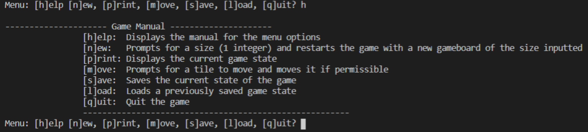

# Mystic_Square

## Description:
A minimal implementation of the mechanics in the sliding puzzle game. Developed in the C language and a simple text interface was utilized as the GUI. During the initialization, the user can choose the size of the puzzle from a 2x2 to a 10x10. The project was made to be modular with separate units for the server, client, and main. Concepts of interprocess communication were practiced. Namely, two processes communicating through pipes. 

## Usage: 
The repository comes with a complete makefile. 

## Commands:
After following the instructions above. By pressing "h", as shown in prompted menu, you will be given a list of the different commands and a brief description for each.

